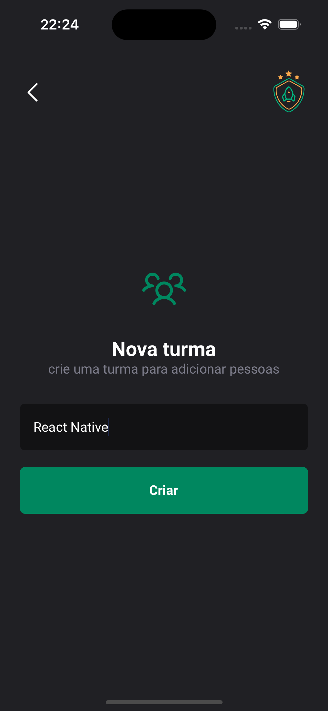
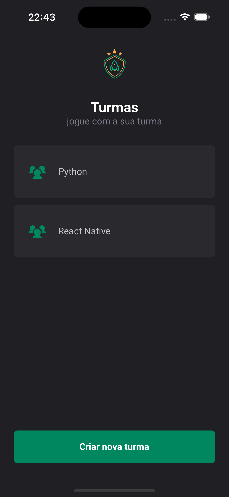
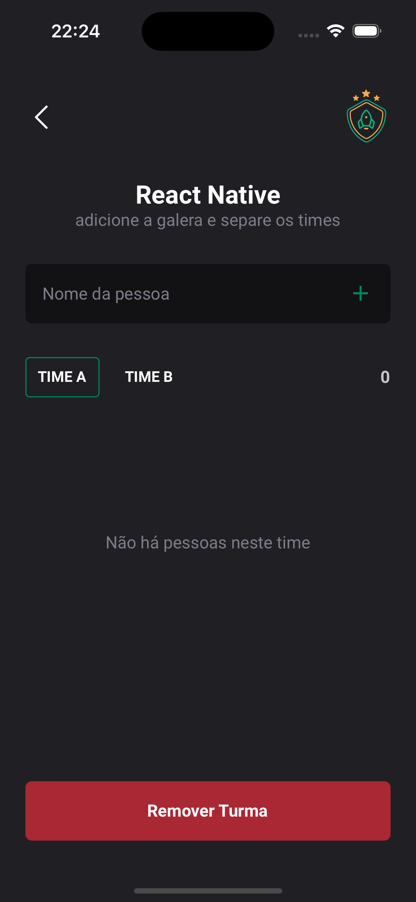
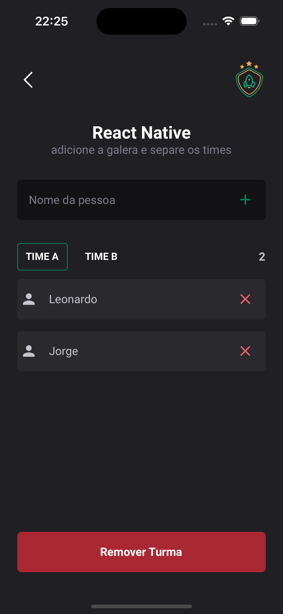
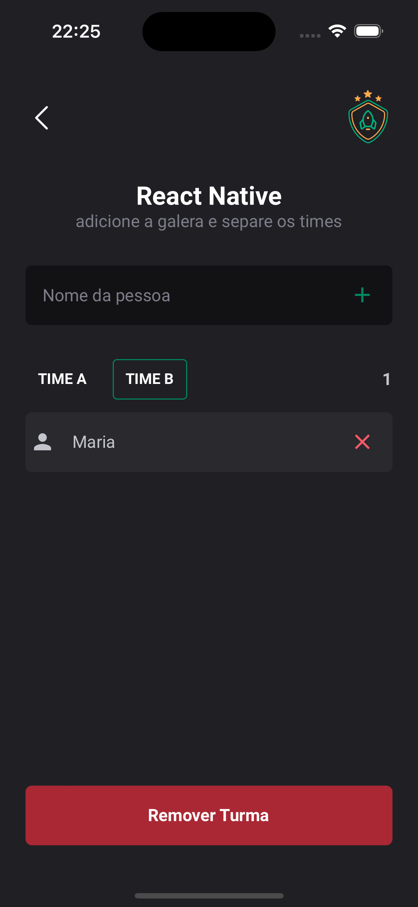
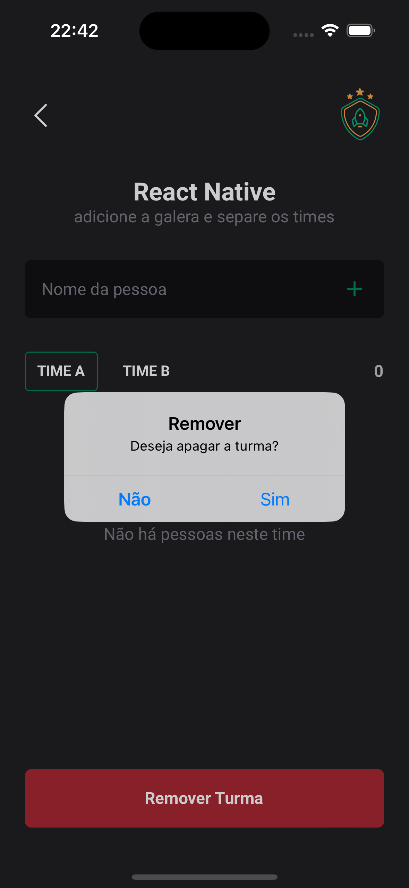

### Projeto IgniteTeams

Este projeto utiliza `nodeJS v18.12.0` e `npm v8.19.2` e configurado com template `Blank with Typescript`.

```bash
npx create-expo-app igniteteams --template
```

Dependências

```bash
# simplifica os path de importação, através de um mapeamento realizado nos arquivos `babel.config.js` e `tsconfig.json`
npm i babel-plugin-module-resolver
# executa a estilização do projeto
$ npm i styled-components
# utilizando fontes externas
npx expo install expo-font @expo-google-fonts/roboto
# biblioteca de ícones
npm i phosphor-react-native
# plugin para utilização de imagens svg
npx expo install react-native-svg
# (core) de navegação
npm i @react-navigate/native
# dependências da biblioteca de navegação (com configurações em código nativo implementadas)
npx expo install react-native-screens react-native-safe-area-context
# estratégia de navegação
npm i @react-navigation/native-stack
# estratégia de armazenamento de dados local
npx expo install @react-native-async-storage/async-storage
```

Dependências de desenvolvimento

```bash
npm i @types/styled-components @types/styled-components-react-native -D
```

## Interfaces

|  |  |  |  |

|  |  |  |

Sequencialmente, da esquerda para direita você pode acompanhar o fluxo de funcionamento da aplicação.

Para gerenciamento de dados na aplicação, se utilizou a estratégia de armazenamento local através do `localStorage`.
